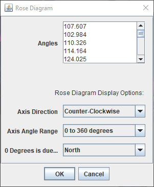

# rose-diagram-fiji
An extension to ImageJ 2 Fiji which plots the distribution of provided angles to a rose diagram

## Installation

1. Make sure Fiji is closed.
2. Locate your Fiji installation folder. 
3. Within it, enter the "plugins" subfolder.
4. Place Rose_Diagram.py from this repository into this "plugins" folder, or one of its subfolders (like "Scripts" or "Utilities").
5. To verify installation, open Fiji, and look at the Plugins menu. You should see "Rose Diagram" on this menu or one of its submenus, depending on exactly where in the "plugins" folder you placed the Rose_Diagram.py file.

## Usage

In Fiji from the Plugins menu, find and click "Rose Diagram". You'll be presented with this dialog:

In the **Angles** textbox, type or paste all the angles you want plotted, one per line. Angles (measured in degrees) should be in the ranges of [0, 360) or (-180, 180] depending on the Axis Angle Range selected below.

That is all you need to provide, but adjusting the settings under "**Rose Diagram Display Options:**" will let you change the orientation of your rose diagram as described below.

The **Axis Direction** selection lets you choose whether angles increment around the diagram clockwise or counter-clockwise.

The **Axis Angle Range** allows you to choose whether you're plotting for angles from 0 all the way to 360 degrees, or whether negative angles should be used. Angles you provide should be in the ranges of [0, 360) or (-180, 180] depending on this selection.

Use the **0 Degrees is due...** dropdown to identify which direction you want 0 degrees to point on the rose diagram.

Click OK and a Rose Diagram should appear in a new 600x600 pixel RBG image within Fiji, much like this:

## Known Issue

Sometimes the resultant image is incomplete; for instance the bars are not drawn or are partially drawn, and you see only a blank or partially blank circular grid. Rerunning the plugin once or twice when this happens usually resolves the issue. The root of the issue has not yet been identified.

## Improvements

I can think of a handful of improvements that could be made to this aside from squashing the known issue above, but I would not call this a roadmap per se. If there is not significant demand, this project will likely not be updated outside of bug fixes.

Some ways this could be improved:

- Support image sizes other than 600x600 pixels
- Allow the user to choose bar colors instead of always using sky blue
- Allow for displaying the mean angle and other values (dispersion, angular variance)
- Add an optional title to the image
- Allow for multiple series of angles on a single plot
